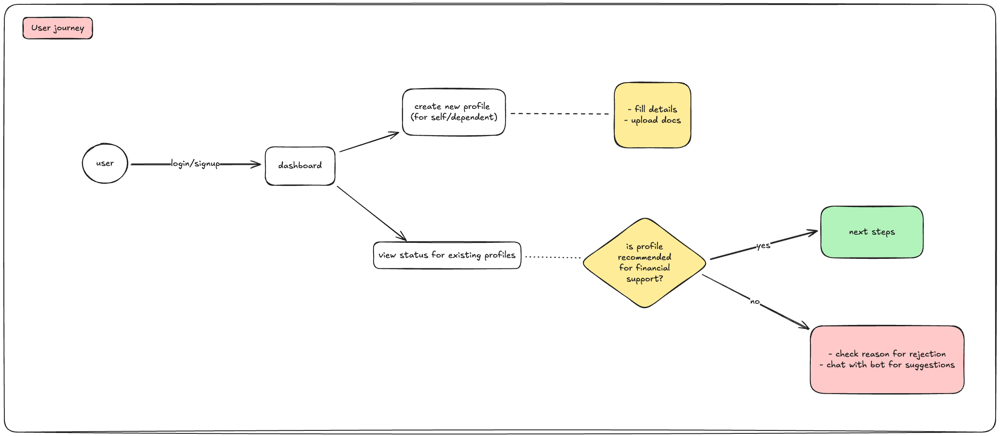

# AI-powered Social Support Recommender
An AI-powered system that can parse documents intelligently and can decide whether  
the person is eligible for financial support or not.  
Users can upload documents like their:  
- resume
- bank statements
- emirates id card
- credit report
- assets/liabilities excel  

After assessment the users can also chat with a bot to know the reasons behind their  
rejection. Additionally the chat-bot can also recommend other ways to for being more  
financially successful catered to specific user profiles.  

# User Journey
A User can login using their username, password (or they can signup using a new email).  
They can upload a host of documents on the dashboard. Before uploading any document,  
they need to create a "profile" of the user they are uploading for, i.e. they need  
to tell name, age, gender, etc of the person they are uploading these documents for.  
While uploading the documents the user must also tell which document is what, so  
they should first select a document from the dropdown and then attach the relevant  
file.  

For now the form and its fields will be in English, but soon we should support 
Arabic as the primary language.

# Frontend
The user‑facing application is built with **Streamlit**, providing a simple web UI.

Key pages:

* **Login / Sign‑up** – authentication for users.
* **Home** – dashboard showing existing profiles and quick actions.
* **Create Profile** – form to capture personal details (name, age, gender, …) before document upload.
* **View Profile** – displays extracted information, recommendation outcome, and a chat interface.
* **Chat Bot** – powered by a LangGraph workflow, users can ask why a decision was made and get personalized advice.

All pages share a consistent look and are responsive for desktop and mobile browsers.

# Tech Spec
For the UI, we have a Streamlit portal with several pages:
- **Login / Sign‑up page** – users authenticate or create an account.
- **Home page** – overview of uploaded profiles and quick actions.
- **View profile page** – display extracted information and recommendation for a selected profile.
- **Create profile page** – collect personal details (name, age, gender, etc.) before uploading documents.
The dashboard is built using **Streamlit**.
For the document processing backend, we have API's built on the FastAPI webserver.  
The document‑processing backend provides FastAPI endpoints.
Extraction is performed by **custom LangGraph workflows** that orchestrate multi‑modal models hosted locally via Ollama.
Extracted data is persisted in a PostgreSQL database.
A recommender workflow consumes all extractions to decide if a profile is eligible for financial support.
Another **LangGraph‑based chatbot** lets users ask about the decision and receive personalized advice.

# Future Roadmap 
Main aim should be to reduce production costs, while increasing accuracy.
## Document validations and preprocessing
We should ideally be doing 3 levels of preprocessing:  
- basic validations  
- custom validations
- image processing  

**Basic validations:**  
We should be checking size of documents uploaded, number of pages (in case of PDFs).

**Custom validations:**  
We should be checking if the user mistakenly submitted the wrong file, or if the  
file is in an unrecognised format, for eg: they submitted their driving licence  
in their id card, which don't support. This would help us in saving LLM inferences.  

**Image preprocessing:**
Most documents people scan are either unevenly lit, or tilted (or both). We need 
to fix as many inconsistencies as possible before we start parsing to improve accuracy  
of production systems.

## For document parsing
Documents that users can upload can be roughly classified in two categories:
- documents with limited formats (like identity cards, credit reports, etc)
- documents with too many formats (like bank statements, resume, etc)

**For documents with limited formats**, we should ideally be building custom rule  
based classifiers to reduce operational costs.
**For documents with no fixed formats** like bank statements, resumes, etc too we 
should ideally be looking at dedicated 3rd party services like Azure/GCP Document 
API's. They typically cost much less than an LLM's inference cost, and can provide 
better outputs, specially with encoded PDF's.
**If we support handwritten forms**, then we should definitely be using OCR services 
like Google vision, instead of relying on a multi-modal model or an in-house OCR 
model like Tesseract or something. The OCR's output can then be fed to a custom 
parser, since the formats are pretty limited.
